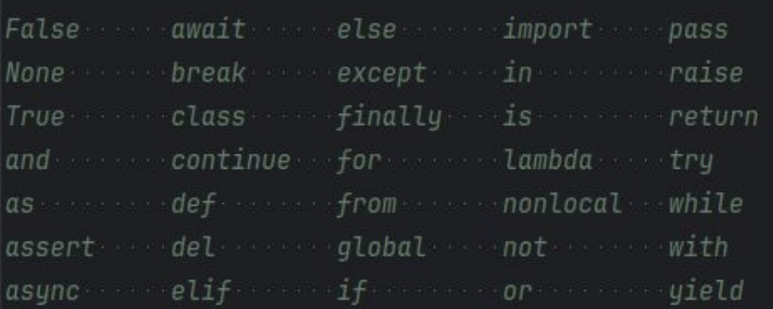

# Python: Variavéis e Operadores matemáticos
- Comandos iniciam com >>>
- Resultados não saem com ">>>"
- input() = ler()
  - OBS: "input" sem um tipo sempre vai ler uma "string", para especificar faça o seguinte:
    - int(input('xxx:'))
- print() = escrever()
- a = b (Atribuição)
- a == b (Operador)

## Convenções em nomenclaturas
- Praticas não obrigatórias de desenvolvimento
- Algumas convenções:
  - snake_case: Usado para nome de variáveis. Letras minúsculas, separando palavras com "_".
  - CamelCase (a.k.a. PascalCase): Usado para nomes de classes (Não usaremos neste semestre).
  - CONSTANTES: letras maiúsculas, com "_" separando palavras (Python não possuí uma definição de constante).

## Palavras Reservadas
- Palavras que possuem significado próprio dentro do Python.


## Tipos de dados
- Use o método "type" para confirmar o tipo de uma variável.
  - Sintaxe = type()
- Numéricos:
  - int: *Integer*, Inteiros
    - Exemplo:
      ```
      >>> type(32) 
      <class 'int'>
      ```
  - float: *Floating-point*, Racionais
    - Exemplo:
      ```
      >>> type(1.0)
      <class 'float'>
      >>> type(10/3)
      <class 'float'>
      >>> type(5/0)
      ERRO
      ```
- Booleanos:
  - bool: True or False
  - Exemplo:
    ```
    >>> bool('a')
    True
    >>> bool('')
    False
    >>> bool(0)
    False
    >>> bool(1)
    True
    ```
- None:
  - Representa a ausência de informação.
  - Algumas linguagens utilizam o termo "null".
  - Exemplo: 
    ```
    >>> bool(None) 
    False
    >>> a = None
    >>> bool(a)
    False
    >>> a == False
    False
    >>> a == True
    False
    >>> a == 0
    False
    ```
  
- String:
  - str: Conjunto de caracteres
  - Pode ser representado com aspas simples, duplas ou 3 aspas duplas, para textos em múltiplas linhas.
  - Exemplos:
    ```
    >>> type('xxx')
    <class 'str'>
    >>> type("xxx")
    <class 'str'>
    >>> type("""xxx 
    ... xxx""")
    <class 'str'>
    ```
  - Para usar aspas no string pode-se:
    - Alternar entre "" e ''
    - Preceder os símbolos com \
    - Exemplos:
      ```
      >>> 'Usando "aspas duplas"'
      'Usando "aspas duplas"'
      >>> "Usando 'aspas duplas'"
      "Usando "aspas duplas'"
      >>> "Usando \"aspas duplas\""
      'Usando "aspas duplas"'
      ```

- List:
  - list: Coleção **mutável** e **ordenada** de itens
  - Exemplo:
    ```
    >>> a = [1, 2, 3]
    >>> type(a)
    <class 'list'>
    >>> b = ['a', 'b']
    >>> d = a + b
    >>> d
    [1, 2, 3, 'a', 'b']
    >>> d[4] = 'python'
    >>> d
    [1, 2, 3, 'a', 'python', 'b']
    ```

- Tupla:
  - tuple: Coleção **imutável** e **ordenada** de itens
  - Exemplo: 
    ```
    >>> a = [1, 2, 3]
    >>> type(a)
    <class 'list'>
    >>> b = ['a', 'b']
    >>> d = a + b
    >>> d
    [1, 2, 3, 'a', 'b']
    >>> d[4] = 'python'
    ERRO
    ```

- Dicionário
  - dict: Conjunto **mutável** de pares chave-valor
  - Muito complicado, aprenderemos mais adiante

- Conjuntos
  - set: Grupo mutável e não-ordenado de itens únicos
  - Não prático

- Conjuntos congelados
  - frozenset: Grupo imutável e não-ordenado

## Operadores matemáticos
 - Adição: +
 - Subtração: -
 - Multiplicação; *
 - Divisão: /
 - Div ou *Floor Division*: //
 - Mod ou *Modulus*: %
 - Exponenciação: **
 - Radiciação: **(Fração)

