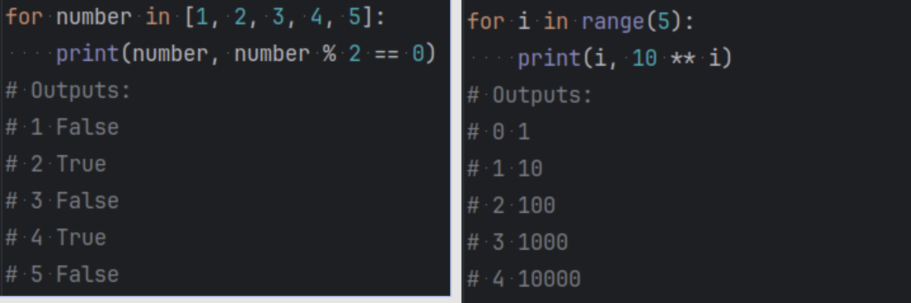
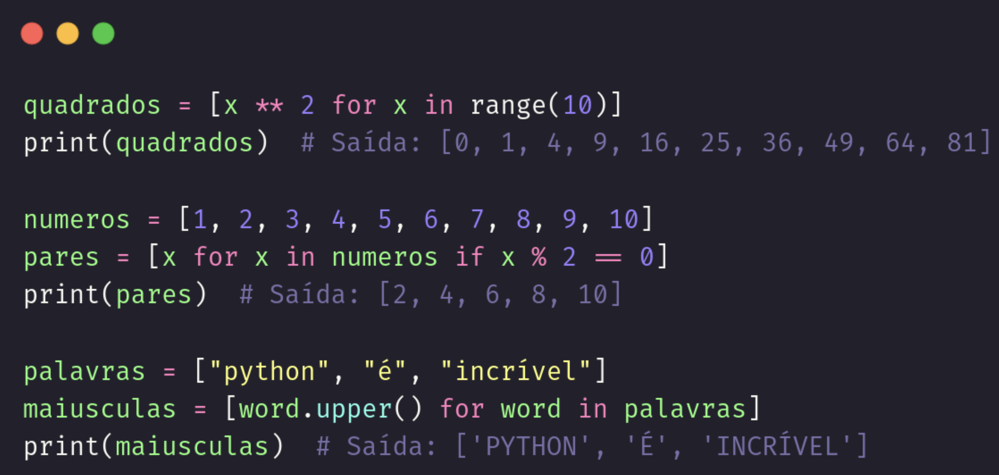

# Python: Listas, Tuplas e laços de repetição
## Comando 'dir'
  - **dir()**: Lista todas variáveis
  - **dir(variável)**: Lista metódos disponíveis nesta variável

## Listas
- Sintaxe:
  - lista = [valor, valor]
- São coleções **mutáveis** e **ordenadas** de itens **heterogêneos**.
  - **Mutável**: adicione, remova ou substitua itens da lista
    - lista.append(valor)
      - Adiciona ao final da lista
    - lista.remove(valor) 
      - Remove na primeira ocorrência
    - variável = lista.pop()
      - Remove o último elemento
    - variável = lista.pop(1)
      - Remove o segundo elemento
    - variável = lista.pop(2)
      - Remove o terceiro elemento
    - lista[posição] = valor
      - Substitui o valor na posição denominada
  - **Ordenada**: acesse os itens através de um índice (*0-based*), sem percorrer toda a lista
    - print(len(lista))
      - Tamanho da lista
    - print(lista[0])
      - Primeiro elemento da lista
    - print(lista[1])
      - Segundo elemento da lista
    - print(lista[-1]) ou print(lista[len(lista) - 1])
      - Último elemento da lista
    - print(list[1:4])
      - Do segundo ao quarto elemento da lista
    - print(lista.index(valor))
      - Posição deste valor na lista
    - print(valor in lista)
      - True: Está na lista
      - False: Não está na lista
    - list[1:4] = [valor, valor, valor]
      - Substitui do segundo ao quarto elemento na lista
  - Itens **heterogêneos**: armazena números, strings, listas, tuplas…
    - Exemplo: \
    

## Tuplas
- Sintaxe:
  - tupla = (valor, valor)
- São coleções **imutáveis** e **ordenadas** de itens **heterogêneos**.
  - **Imutável**: tupla não pode ser alterada após sua criação.
- Pode-se usar todos comandos já citados os quais não encvolvem a mudança de um valor dentro da lista.

## Laços de repetição
### for
- Itera por uma lista de itens, executando o mesmo trecho de código para cada elemento. \
  
### while
- Executa um trecho enquanto a condição for verdadeira.
- Sintaxe:
  - while *condição*: \
    *bloco de comando*
### list comprehension
- *syntatuc sugar*
- similar ao ‘if ternário’, possibilitando operações com listas em uma única linha. \
  

# Notas Gerais
- -= (atribui a tal valor um a menos dele mesmo)
- += (atribui a tal valor um a mais dele mesmo)

