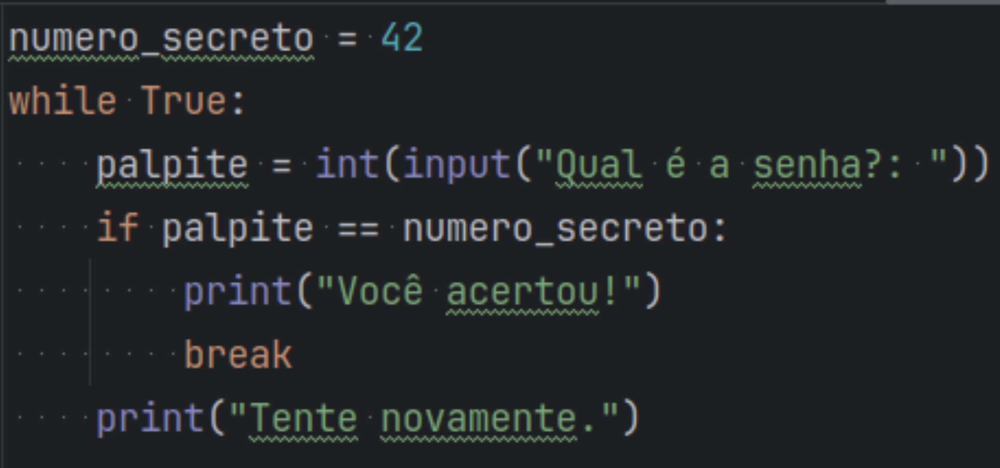
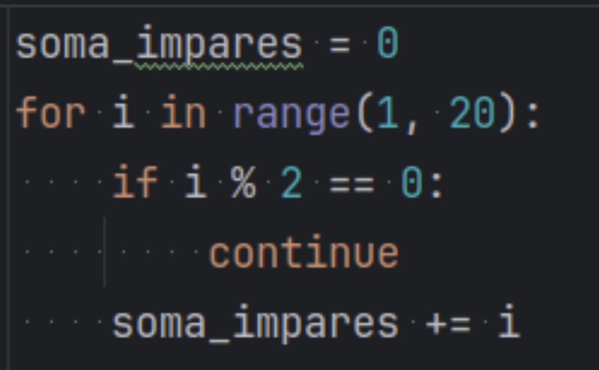

# Continuação da aula passada

## Listas alinhadas
- São listas onde cada elemento armazena outra lista
- Quando a variável armazena 2 dimensões, também chamamos de matrizes (similar à tabelas)

## Controles de fluxo

### break
- Interrompe o laço de repetição no qual está dentro
- Funciona para tanto while quanto for \

### continue
- Usado para "pular" a próxima interação
- Funciona para tanto while quanto for \
