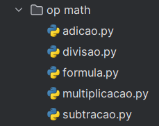
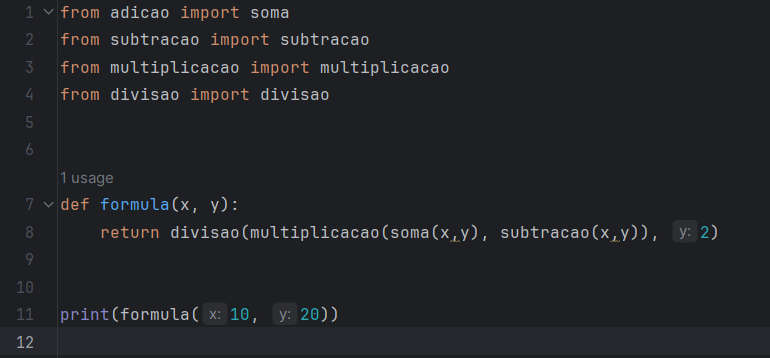

# Python: Funções e Imports

## Comando import: motivação
- Conforme um programa cresce, mais difícil fica de organiza-lô, então e torna necessário separar métodos em múltiplos arquivos. 
- Benefícios
  - Organização e Legibilidade
  - Reutilização de Código: Tanto no seu projeto, quanto me projetos diferentes
  - Colaboração: Permite membros de uma equipe trabalharem em diferentes partes de uma mesmo código simultaneamente
  - Facilidade de Teste e Depuração: Uma vez que cada parte do código é testada isoladamente
  - Desempenho
````
# math é um arquivo já instalado no python
# "from arquivo import *" para dar import em todos comandos do aruivo selecionado

from math import sqrt, pow, factorial

# Método para calcular hipotenusa
def calcular_hip(cateto1, cateto2):
    soma_qua = por(cateto1,2) + pow(cateto2, 2)
    return sqrt(soma_qua)

# Método para calcular fatorial de um número
def calcular_fat(num):
    return factorial(num)
````


- Resultado: -150.0
## Arquivo __init__.py
- Arquivo brigatório para que o Python reconheça a pasta como um pacote e permita a importação de módulos dele.
- **NÃO APAGUE NUNCA**

## Funções
### Recursividade
- Executar outras funções ou chamar a elas mesmas. Quando isso ocorre,chamamos de recursividade.
- Basicamente, como uma fatorial (!) na matemática.
````
def fatorial(x)
    if x == 0
        return 1
    if x > 0
        return x * fatorial(x - 1)
    return None
````
