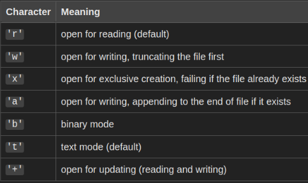

# Python: Manipulação de arquivos
**Sempre manter em mente: onde está a posição do cursor?**
- Comando para abrir o arquivo (ou usar *with*)
- Comandos para operar no arquivo
- Comando para fechar o arquivo (ou usar *with*)
## Criar arquivos
````
# Abre um arquivo para leitura (falha se não existir)
file = open("arquivo.txt", "r")

# Abre um arquivo para escrita (cria se não existir) 
file = open("arquivo.txt", "w")

# Abre um arquivo para acrescentar conteúdo
file = open("arquivo.txt", "a") # 'a'=='append'
````
### Read
    - Arquivo não existe? Falha
    - Arquivo existe? Salva conteúdo 

### Write
    - Arquivo não existe? Cria
    - Arquivo existe? Apaga/Sobrescreve conteúdo

### Modos de abertura
[Fonte](https://docs.python.org/3/library/functions.html#open)


## Ler Arquivos
````
file = open("arquivo.txt", "r")

content = file.read() # Lê TODO o conteúdo do arquivo
print(content)

line = file.readline() # Lê uma linha do arquivo
print(line)

lines = file.readlines() # Lê todas as linhas do arquivo em uma lista
print(lines)
print(''.join(lines))
````
````
file = open("arquivo.txt", "r+")
print(file.readline())  # Output: linha 1
print(file.readline())  # Output: linha 2
print(file.readline())  # Output: linha 3

file.seek(0)  # Retorna para o início do arquivo
print(file.readline())  # Output: linha 1
print(file.readline())  # Output: linha 2
print(file.readline())  # Output: linha 3

file.close()
````
## Alterar arquivos
````
file = open("arquivo.txt", "r+")

# Escreve no arquivo
file.write("First line\n")
file.write("Second line\n")
file.writelines(["Third\n", 'Fourth\n' 'Fifth'])

# Sempre feche um arquivo após usá-lo para liberar
# recursos do sistema operacional
file.close()
````
## Exemplo completo
````
file = open("arquivo.txt", "w") # Abrindo para escrita
file.write("Hello, World!\n")
file.write("Python é incrível!\n")
file.close() # Fechando o arquivo

file = open("arquivo.txt", "r") # Abrindo para leitura
content = file.read() # Lendo o conteúdo inteiro
print(content)
file.close() # Fechando o arquivo
````
## Bloco with
- Variável só existe durante o bloco de execução
````
with open("arquivo.txt", "r") as arquivo:
    conteudo = arquivo.read()
    print(conteudo)
# Dispensa a necessidade de arquivo.close()
````
## Verificar existência
- Booleano
````
import os

existe_arquivo = os.path.exists('arquivo.txt')
existe_pasta = os.path.exists('pasta')
````
## Criação de pasta
- Cria a pasta com o nome informado ou falha se já existir
````
import os

pasta = 'minha_pasta'
if not os.path.exists(pasta):
    os.mkdir(pasta)
    print(f"A pasta '{pasta}' foi criada com sucesso.")
else:
    print(f"A pasta '{pasta}' já existe.")
````

