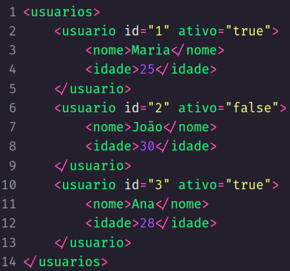
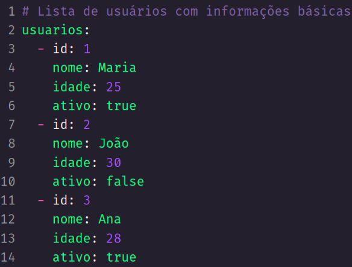
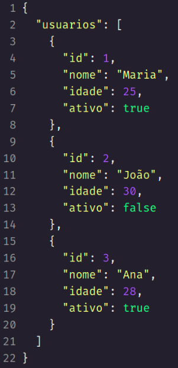
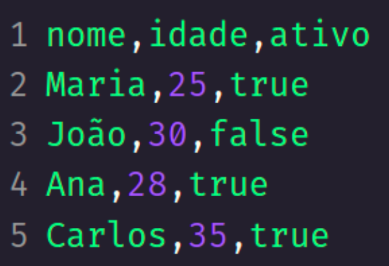
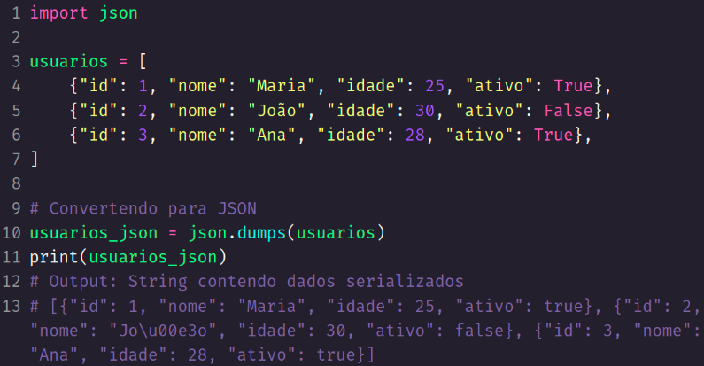
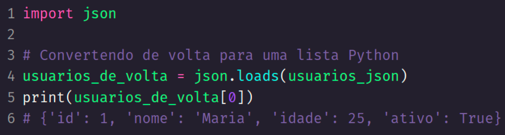

# Python: serialização com JSON, XML e CSV
## Application Programming Interface (API)
- Conjunto de regras que permitem que diferentes softwares se comuniquem entre si. 
- Exemplo: um app de celular envie e receba informações para um servidor. 
- Tal capacidade é chamada de **interoperabilidade** entre diferentes sistemas.
## Serialização
- Processo de converter uma estrutura de dados em um formato que pode ser facilmente armazenado ou transmitido e posteriormente reconstruído.
- Pode ser via texto ou em bytes. 
- A **deserialização** é o processo inverso, onde os dados serializados são convertidos de volta para o objeto original.
## XML (eXtensible Markup Language):
- Bastante popular e presente em muitos sistemas antigos
- Mais verbosa que alternativas
- Pode conter comentários no conteúdo

## YAML (Yet Another Markup Language):
- Possibilita comentários
- Pouco comum no uso de transmissão de dados entre sistemas (muito popular para armazenar configurações de aplicações)
- Fácil leitura e depende de identação (assim como Python)

## JavaScript Object Notation (JSON)
- Fácil leitura e não verboso (reduz quantidade de dados enviados)
- Amplamente utilizado na indústria para transmissão de dados entre sistemas
- Não oferece comentários nativamente (possível através de campos string)

## Comma-Separated Values (CSV)
- Formato simples e não proprietário (alternativa ao Excel), utilizado para armazenar dados tabulares em texto. 
    - Não é utilizado para transmitir dados entre aplicações, mas é útil para geração de relatórios
    - Não consegue armazenar dados complexos
    - Não pode conter comentários

## Serializando dados

## Deserializando dados
